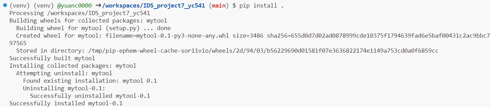
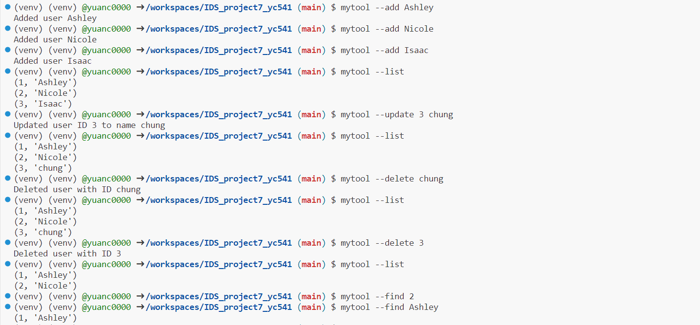

# Package a Python Script into a Command-Line Tool

## Introduction

This project's main objective is to demonstrate how to package a Python script into a command-line tool. With the help of the `setuptools` library, we'll turn our script, which manages a user database, into a user-friendly command-line application.

## Project Structure

The project is organized into the following main components:

- `mytool/`: A directory containing the core scripts and modules.
  - `__init__.py`: An empty file required to treat directories as containing packages.
  - `myscript.py`: Contains the core functionalities to interact with the SQLite database, such as adding, listing, updating, and deleting users.

- `setup.py`: This script contains metadata about the project and is used by `setuptools` to package the project into a distributable format.

## Building the Tool

The tool's creation process involved the following steps:

1. **Set Up the Virtual Environment**: Before starting, we set up a Python virtual environment to manage dependencies cleanly.

2. **Write the Script**: Developed the `myscript.py` which interacts with an SQLite database to manage users.

3. **Setup Script**: The `setup.py` file is used to provide metadata about the project. It informs `setuptools` about the components of the project.

4. **Install `wheel`**: Before packaging the project, we installed the `wheel` package using `pip install wheel`, which provides a bdist_wheel command for setuptools. It creates `.whl` files which can be installed using `pip`.

5. **Packaging the Project**: Using the command `python setup.py sdist`, we can generate a source distribution of the project.

6. **Install Locally**: With `pip install .`, we instruct pip to install the package locally. This command will use `setup.py` to identify the project dependencies and install them.


## User Guide

### Installation

After cloning the project, navigate to the root directory and run:

```bash
pip install .
```

This command will install the project and its dependencies. It uses the setup.py script to understand the project's structure and necessary dependencies.

### Using the Tool

Here are the commands to interact with the user management system:

#### Add a New User:

```bash
mytool --add [NAME]
```

#### List All Users:

```bash
mytool --list
```

#### Update a User's Name:

```bash
mytool --update [ID] [NEW_NAME]
```

#### Delete a User:

```bash
mytool --delete [ID]
```

#### Find Users by Name:

```bash
mytool --find [NAME]
```


## Conclusion

Packaging Python scripts into command-line tools can significantly enhance user experience and distribution. With the power of setuptools and careful structuring, you can turn even complex applications into user-friendly command-line tools.
